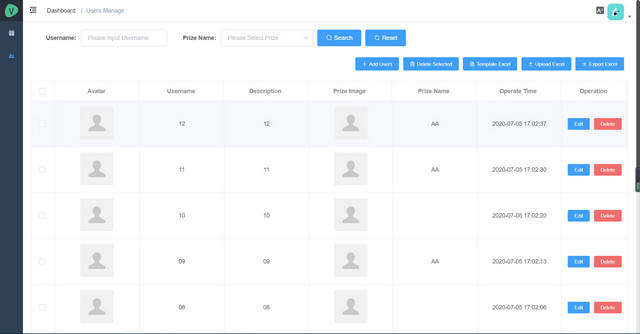

# lottery-vue-electron

Language: [English](./README-en.md) | [中文简体](./README.md)

> A small project of the company's annual meeting lottery

## Features
1. Adopt Vue+Electron technology development, support cross-platform packaging
2. Alternative paper lottery draw, keep prizes and personnel records after the draw
3. According to the prize level, the lottery method is divided into single draw and full draw
4. Support Excel way to import and export prizes and personnel information

## Project preview




## Project setup
```
npm install
yarn install
```

### Compiles and hot-reloads for development
```
npm run electron:serve
yarn run electron:serve
```

### Compiles and minifies for production
```
npm run electron:build
yarn run electron:build
```
