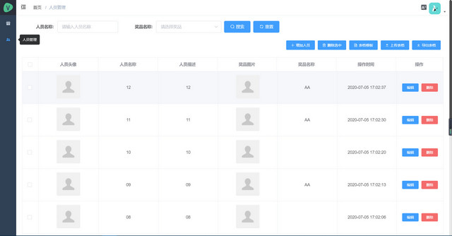

# lottery-vue-electron

Language: [English](./README-en.md) | [中文简体](./README.md)

> 一个公司年会抽奖的小项目

## 特点
1. 采用Vue+Electron技术开发，支持跨平台打包
2. 替代纸条抽奖方式，抽奖完成后保留奖品和人员记录
3. 抽奖方式按奖品等级分为单抽和全抽两种方式
4. 支持Excel方式导入和导出奖品和人员信息

## 项目预览




## 项目初始化
```
npm install
yarn install
```

### 编译和热加载以进行开发
```
npm run electron:serve
yarn run electron:serve
```

### 编译并最小化打包
```
npm run electron:build
yarn run electron:build
```
